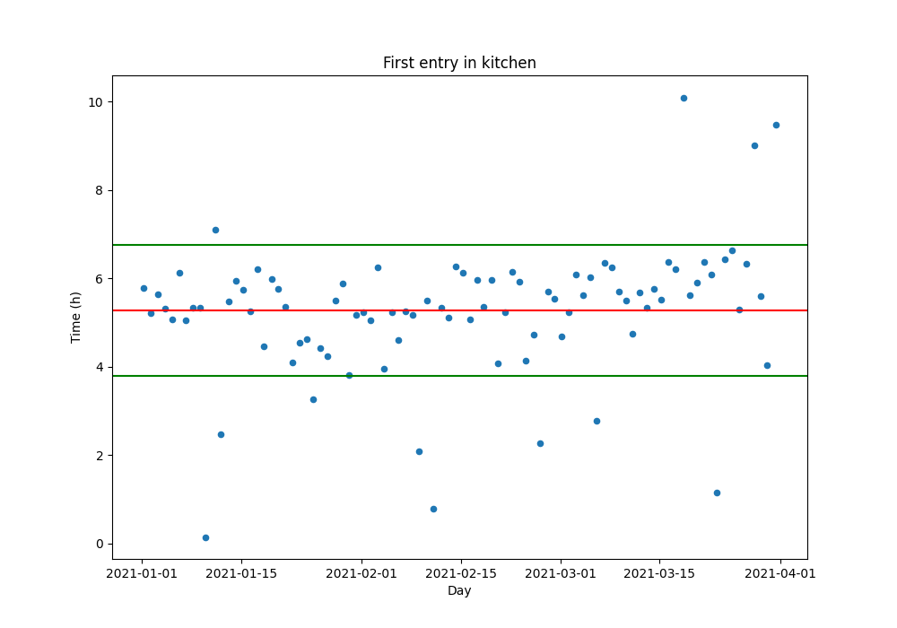

# Adelego project

**Adelego** is a project created to help dependent people live longer and more safely at home & improve the help caregivers can provide.

## The problem
A person becomes **dependent** because of their age, a disability and/or an illness and a **caregiver** is a person who helps dependent people in their daily life. When an accident happens to dependent people or people living by themselves, their health can be severely impacted. Countries across Europe and the Americas are aging leading to an increase in the number of dependent people and consequently, caregivers.

Today, it is estimated that about 1 in 5 people is a caregiver in Europe and North America and this number is expected to increase for the next few decades due to the aging of baby boomers. Unfortunately, this situation is not sustainable economically due to the increasing proportion of dependent people and the global impoverishment of the population. To solve this societal issue, we want to develop solutions that are *simple, robust, easy to use and affordable*.

## Our project
We are turning to the use of connected objects and the implementation of digital applications to develop a **personalized local home surveillance system** that allows people who are living by themselves and/or dependent to live safer and longer in their own home.

Because each situation is unique and changes over time, our approach is to create a **platform** that will provide a variety of tools users can select based on their needs. It is the combination of these tools that will create the personalized local home surveillance system. Each tool will consist of a program in link with connected objects to:
1. record and analyze data locally;
2. send an alert (by phone or email) to a trusted third party when an unusual activity is detected, such as a fall. The third party will be someone the user knows and trusts such as a neighbor, a family member or a nurse.

## First prototype
We are currently building a first prototype consisting of a detector connected to a Raspberry Pi 4 on which we installed Jeedom.

The detector we are working with is [Multisensor 6](https://aeotec.com/z-wave-sensor/) from Aeotec. This detector can sense humidity, temperature, presence, UV, brightness and vibration. It uses the Z-wave protocol to communicate to its antenna ([Z-stick Gen 5+](https://aeotec.com/z-wave-usb-stick/) from Aeotec) that is hooked up to the Raspberry Pi 4.

*Raspberry Pi 4 and the antenna (left) and Multisensor 6 detector (right)*

  

[Jeedom](https://www.jeedom.com/en/) is an open-source software that is designed to create a personalized home automation system. We are currently using Jeedom to collect and export our data as CSV files.

The detector has been placed at the entrance of our kitchen since December 1st 2020 and has been recording data continuously.

## Data analysis
The appropriate data analysis is essential to detect any unusual activity. Our current strategy is to use the Python library, *pandas*, to analyze the data that has been recovered in CSV files. 
### Step 1: Analysis of 3 months of data to generate a history
We first did an analysis of the data over a period of 3 months from January 1st 2021 until March 31st 2021 in order to get a history and figure out a pattern.
Information we obtained from this analysis:
- What time do we enter the kitchen for the first time of the day?
- How much time do we spend in the kitchen per day?
- 
For both questions, the goal was to provide the mean, standard deviation and a graph. Below are the graphs summarizing our analysis. On both graphs, the red line represents the average and the green lines are located 1 standard deviation away from the average.

 

 

**With this analysis, we then defined that any data located between the two standard deviation lines were considered "normal" while any data that would be outside of these lines would be subjected to concern.**

### Step 2: Analyze incoming data automatically
The next step of our analysis is to automatically analyze incoming data, compare the results to the history generated with the 3 months of data and send a notification via email. With Jeedom's plugins, we programmed our system to receive an email at midnight everyday containing a CSV file with the data from the last 24 hours. We wrote code that provides the first time we enter the kitchen and the time spent in the kitchen per day for each incoming file. This analysis was started on April 1st 2021.
The picture below is a screenshot of the dataframe generated on April 21st 2021. This table includes the following columns:
- **First time**: time when we entered the kitchen for the first time of the day
- **First time range**: range indicating if the ***First time*** is in the normal range or if it is early or late compared to the history*
- **Time spent**: time we spent in the kitchen for the day
- **Time spent range**: range indicated if the ***Time spent*** is in the normal range or if it is low or high compared to the history*

\*Note: the normal range is any value that falls in between the 2 standard deviations calculated with the 3 months of data.
 
 

## Let's work together
If you want to develop this project with us or have ideas/suggestions, feel free to contact me on GitHub or <adele.jmb@gmail.com>.

We also created a GitHub page (in french for now) with more information on the project and our vision [here](https://mbonnemaison.github.io/adelego/).

*We thank the [Boston Python group](https://about.bostonpython.com) for allowing us to use their GitHub page as a model for our GitHub page.*
