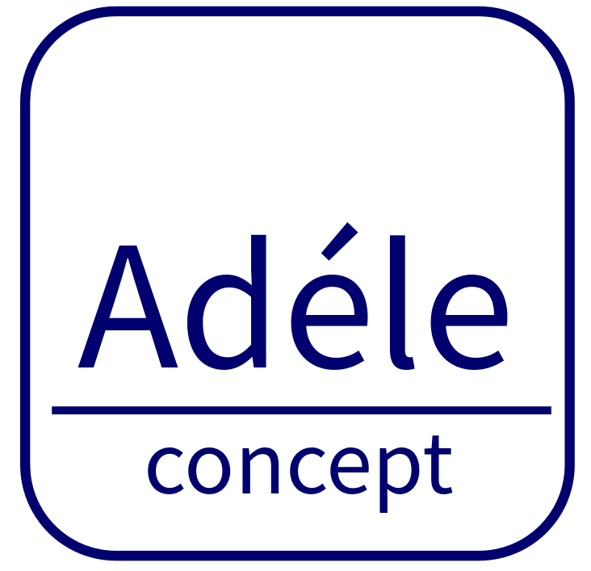

Le projet **Adelego** est parrainé par l'association *Adéle*, créée en 2002 qui aide les personnes à créer leur propre emploi. Nous croyons que chacun d’entre nous possède de nombreuses qualités dans beaucoup de domaines mais qui doivent être révélées et ordonnées. En permettant à chacun d’analyser ses capacités par ses vécus, il est possible de redonner à chacun une dignité et une nouvelle vision d’eux-mêmes et de leurs capacités à exister en réalisant un projet professionnel correspondant à leur personnalité et leurs compétences. Nous croyons profondément en l’humain et a sa capacité à se surpasser quand il est mis en confiance et l’aider à construire son projet de vie.

Notre expérience nous a fait comprendre la souffrance de beaucoup de personnes pour trouver leur vraie vocation en accord avec leurs compétences et leur désir de mieux s’insérer dans la vie sociale.
Nous avons aussi été confrontés dans nos rencontres à de véritables naufrages humains ou nos participants perdaient confiance en eux suite à des pertes d’emploi ou des drames personnels.

Parmi tout ce vécu, notre travail de terrain nous a amené à nous intéresser également aux familles qui doivent aider un de leur proche qui est ou qui est devenu trop dépendant pour être autonome dans sa vie. On peut penser aux parents atteints par la vieillesse ou toute autre personne aimée, touchée par un profond handicap physique ou psychique. Dans un premier temps, ce sont les proches qui vont venir en aide, puis quand le handicap deviendra plus important, il faudra alors le confier à des institutions spécialisées pour accompagner la personne.
Ce que nous avons pu constater, c’est qu’il existe une longue période où c’est l’aidant qui doit affronter en soignant la personne dépendante en mettant parfois de côté sa vie personnelle, relationnelle et professionnelle, pour s’engager de plus en plus dans l’assistance du malade.
Malgré toutes les aides publiques de conseils et d’assistante, il n’existe pas vraiment de solutions pérennes et économiquement viables pour soulager l’aidant qui finit par y laisser lui aussi sa santé et oublier sa propre vie. Beaucoup de personnes se remettent difficilement d’une telle épreuve.

C’est pourquoi, nous avons pensé qu’il était désormais de notre mission de chercher des moyens de soulager les aidants de façon pragmatique, économique en mettant en place une application numérique dans l’habitat permettant de soulager au quotidien tous les intervenants auprès de la personne dépendante.

Cette application est la mise en place dans l’habitat de capteurs relié à un serveur qui fournit en continu des données sur la façon de vivre de la personnes dépendante et qui restitue un historique des données avec des seuils d’alerte en cas de besoins. Ce système reste confidentiel et les données ne sont accessibles qu’aux aidants accrédités par la famille.

Ce système s’appelle Adelego.

